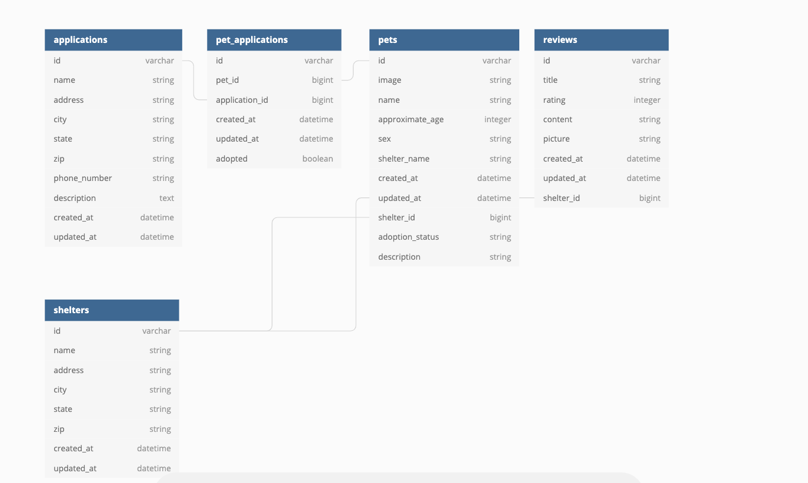

## Welcome to Adopt Don't Shop!

By Will Meighan (github.com/Will-Meighan) and Elom A (github.com/eamouzou)

Link to our heroku app: https://glacial-journey-11999.herokuapp.com/

This is a fictional adoption shelter manager that allows the user to add/edit/delete shelters, add/edit/delete pets, assign pets to each shelter, and put in applications to adopt those pets. It allows for easy navigation from all web pages of the app.

To begin, please follow these steps;
1. Click the "fork" button in the upper right hand corner of the screen.
2. Click the green "clone or download" dropdown menu and copy the text.
3. On your local device, from the directory that you would like to store this code, enter the command 'git clone <copied_text>' and click enter.

Now you have our code cloned onto your device! To start interacting with the app, follow these commands in the terminal of your cloned project;
1. Enter 'rails db:create' into your command line (Depending on the setup of your computer, you may need to prefix that command with 'bundle exec').
2. Enter 'rails db:migrate'
3. Enter 'rails db:seed'
4. Enter 'rails s'

From here, navigate to your web browser and enter the address http://localhost:3000/ and begin having fun! We hope you enjoy!

## Database Diagram

Please find our database diagram above. It illustrates the relationships between our models and the data they interact with.
